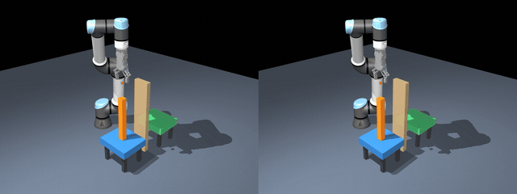
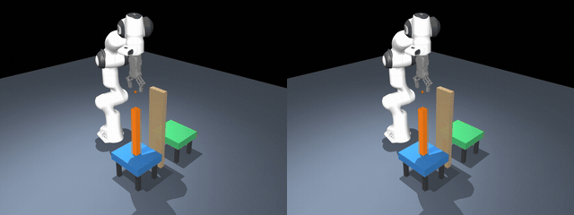
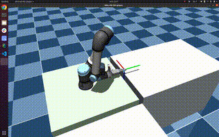
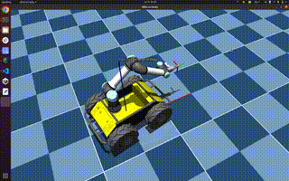
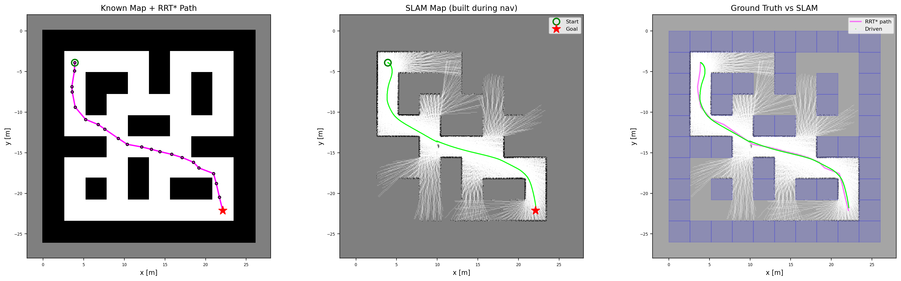
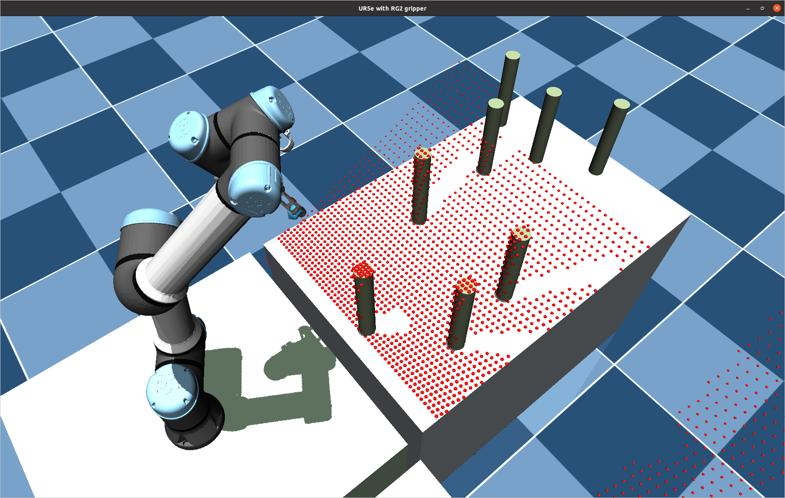
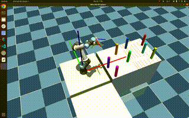
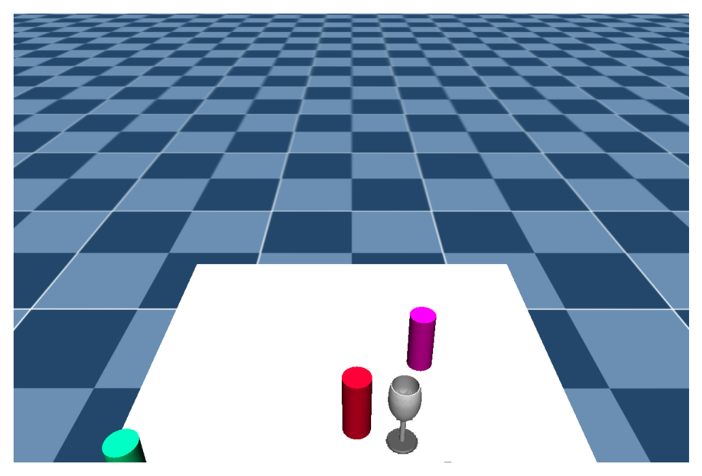
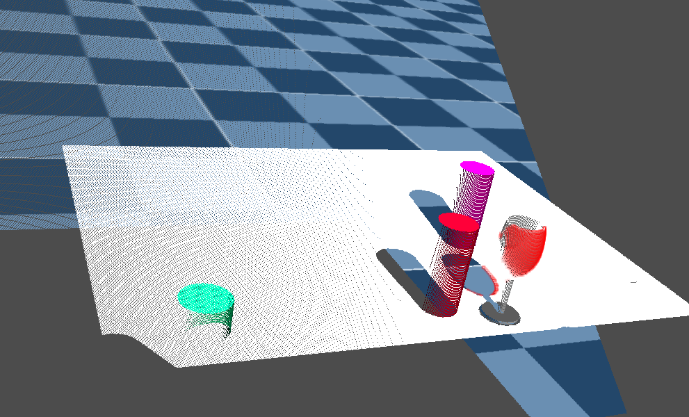

# mujoco-robotics-usage
This repo provides minimal hands-on code for MuJoCo Robotics Algorithms.

(This repository only covers the MuJoCo simulation. Realworld is not included)

## Manipulator: UR5e / Franka interaction MPC

[잡기 → Table A에서 B로 막대 옮기기](code/manipulator/TABLE_TRANSFER.md)도 지원합니다.
저장소의 RG2 그리퍼로 세워진 막대를 집고, 벽을 우회하거나 벽 접촉 후 후퇴·우회하여
B에 놓고 손을 뗍니다. UR5e / Franka × 두 케이스를 실행하려면:

```bash
.venv/bin/pip install -r code/manipulator/requirements_mpc.txt
.venv/bin/python code/manipulator/demo_table_transfer.py --video
```

RG2 영상과 로그는 `outputs/table_transfer_rg2/`에 저장됩니다.
아래 GIF에서 왼쪽은 알려진 벽 우회, 오른쪽은 접촉 감지 후 후퇴·우회입니다.

**UR5e**

<p align="center"></p>

**Franka**

<p align="center"></p>

[실행 방법·제어식·검증 범위](code/manipulator/INTERACTION_MPC.md): 관절 상태와 구동 토크로
EE 외력을 추정하고, 같은 MPC로 물체 하중과 벽 접촉을 처리하는 토크 제어 데모입니다.
외력 방향의 순응 동작, 동적 reference slack, 관절별 토크 여유 최적화를 포함합니다.

```bash
python3 -m venv .venv
.venv/bin/pip install -r code/manipulator/requirements_mpc.txt
.venv/bin/python code/manipulator/demo_interaction_mpc.py --robot both --scenario combined --video
```

결과는 `outputs/interaction_mpc/`에 MP4, 그래프, 시계열 NPZ, JSON 지표로 저장됩니다.
기존 노트북용 XML은 변경하지 않으며, 이 데모는 MuJoCo 3.3.7을 사용합니다.

MuJoCo related code is employed from following repos: 

* [MuJoCo] https://github.com/deepmind/mujoco
* [YAMT] https://github.com/sjchoi86/yet-another-mujoco-tutorial-v3

Some of the robot models referenced mujoco_menagerie
* [mujoco_menagerie] https://github.com/deepmind/mujoco_menagerie

## Prerequisites

This repo is tested on following environment:

* Ubuntu: 20.04
* Python: 3.8.10
* mujoco: 2.3.2

### Install dependencies

Mujoco Engine
```bash
pip install mujoco

pip install mujoco-python-viewer
```

### Descriptions
Below is a list of files and their descriptions:

* Kinematic Solver
    1. Solve inverse kinematics in various method with 
        * [General]
            <p float="left">
            
            
            </p>

        * [Augmented],
        * [Nullspace projection]
        * [Repelling]
        * [RRT*]
        
        
* Trajectory Planning method
    1. [Task space planning]
        * [Quintic]

        <p float="left">
            
        </p>

        * [Minimum Jerk]
        * [Linear movement]
    2. [Velocity profile method]: 
        * [Trapezoidal]
        * [s-Spline method]
    
* Demos
  1. [Pick-n-Place]
        <p align="center">
            
        </p>
    
* Mobile Planning method
    1. [Mobile Velocity Control]
        <p align="center">
            
        </p>
    2. [SLAM + RRT* + Navigation]
        * 2D LiDAR SLAM (occupancy grid mapping with 72 rangefinder sensors)
        * RRT* global path planning on SLAM map
        * Local planners: Pure Pursuit, Stanley Controller, MPPI
        * Dynamic obstacle avoidance with local path deformation

        <p align="center">
            
        </p>
        <p align="center">
            
        </p>
        <p align="center">
            
        </p>

        Code: `code/mobile/demo_husky_06_slam.ipynb` ~ `demo_husky_10_rrt_w_avoidance.ipynb`
        
        
* Point-cloud
    1. [Point-cloud Projection]
        <p float="left">
            
        </p>
        <p float="left">
            
        </p>

    2. [Colored pointcloud]
        <p float="left">
            
            
        </p>
        When input RGBD has given, converts it to corresponding colored pointcloud in a row.

        Code: 
        [demo_colored_pcd.ipynb](code/point-cloud/demo_colored_pcd.ipynb)

    3. [Iterative Closet Point]
    4. [Extrinsic calibration]
    
    
* Segmentations
    * [Unseen Object Clustering (UCN)](https://github.com/NVlabs/UnseenObjectClustering)
    * [Segment-Anything (SAM)](https://github.com/facebookresearch/segment-anything)

* Miscellaneous
    * [Multi-vivwer] Add Multi-Viewer toy examples: Get images from camera defined in an XML(MJCF) files.
        <p float="left">
        
        
        </p>
