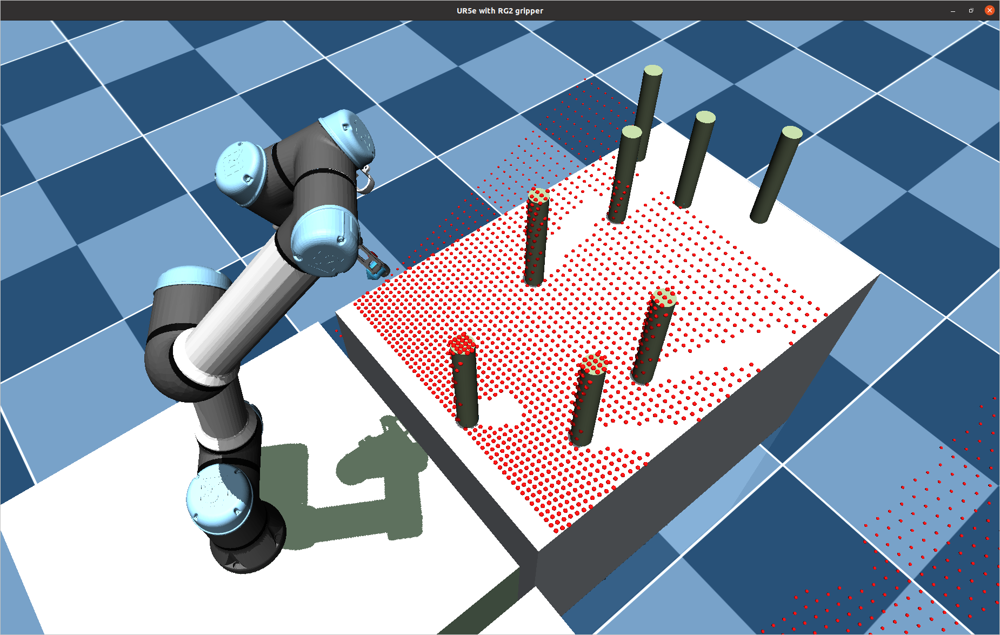

# mujoco-robotics-usage
This repo provides minimal hands-on code for MuJoCo Robotics Algorithms.

(This repository only covers the MuJoCo simulation. Realworld is not included)

MuJoCo related code is employed from following repos: 

* [MuJoCo] https://github.com/deepmind/mujoco
* [YAMT] https://github.com/sjchoi86/yet-another-mujoco-tutorial-v3

Some of the robot models referenced mujoco_menagerie
* [mujoco_menagerie] https://github.com/deepmind/mujoco_menagerie

## Prerequisites

This repo is tested on following environment:

* Ubuntu: 20.04
* Python: 3.8.10
* mujoco: 2.3.2

### Install dependencies

Mujoco Engine
```bash
pip install mujoco

pip install mujoco-python-viewer
```

### Descriptions
Below is a list of files and their descriptions:

* Kinematic Solver
    1. Solve inverse kinematics in various method with 
        * [General]
            <p float="left">
            
            >
            </p>
        * [Augmented],
        * [Nullspace projection]
        * [Repelling]
        * [RRT*]
        
        
* Trajectory Planning method
    1. [Task space planning]
        * [Quintic]
        <p float="left">
        
        
        </p>
        * [Minimum Jerk]
        * [Linear movement]
    2. [Velocity profile method]: 
        * [Trapezoidal]
        * [s-Spline method]
    
* Demos
  1. [Pick-n-Place]
        <p align="center">
            
        </p>
    
* Mobile Planning method
    1. [Mobile Velocity Control]
        <p align="center">
            
        </p>
    2. [Global planner]
        * [A*]
        * [RRT]
        * [RRT*]
    3. [Local planner]
        * [Pure-pursuit]
        
        
* Point-cloud
    1. [Point-cloud Projection]
        <p align="center">
            
        </p>
        <p align="center">
            
        </p>

    2. [RANSAC]
    3. [Iterative Closet Point]
    4. [Extrinsic calibration]
    
    
* Segmentations
    * [Unseen Object Clustering (UCN)](https://github.com/NVlabs/UnseenObjectClustering)
    * [Segment-Anything (SAM)](https://github.com/facebookresearch/segment-anything)

* Miscellaneous
    * [Multi-vivwer] Add Multi-Viewer toy examples: Get images from camera defined in an XML(MJCF) files.
        <p float="left">
        
        >
        </p>